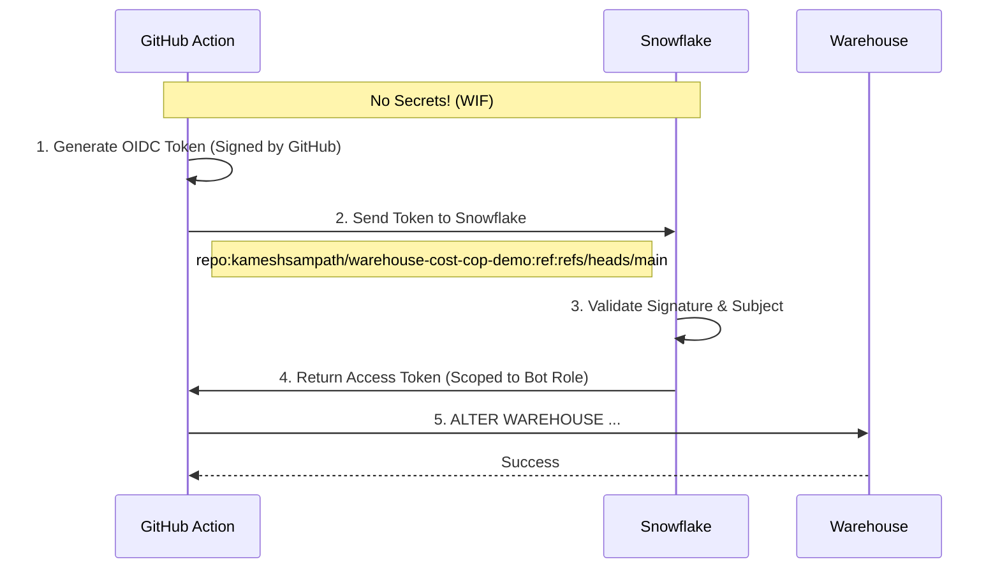

# Warehouse Cost Cop

A GitHub Actions bot that enforces cost policies on Snowflake warehouses—authenticated via OIDC, no passwords required.

## What it does

Developers spin up warehouses and forget to configure auto-suspend. This bot runs on a schedule (or on-demand), discovers warehouses matching a naming pattern, and forces them into compliance:

- `WAREHOUSE_SIZE` → `X-SMALL`
- `AUTO_SUSPEND` → `60` seconds
- `STATEMENT_TIMEOUT_IN_SECONDS` → `300`

The workflow authenticates to Snowflake using GitHub's OIDC tokens and Snowflake's Workload Identity Federation. No static credentials, no secrets to rotate.

## Prerequisites

- A Snowflake account with `ACCOUNTADMIN` access (for initial setup)
- A GitHub repository (fork this repo to your own account)

### Required Tools

| Tool | Purpose | Installation |
|------|---------|--------------|
| [Snowflake CLI](https://docs.snowflake.com/en/developer-guide/snowflake-cli/index) | Run SQL scripts and test connections | `pip install snowflake-cli` or `brew install snowflake-cli` |

### Optional Tools

| Tool | Purpose | Installation |
|------|---------|--------------|
| [Task](https://taskfile.dev/) | Task runner for common commands | `brew install go-task` |
| [jq](https://jqlang.github.io/jq/) | Parse JSON output from CLI commands | `brew install jq` |
| [gh](https://cli.github.com/) | GitHub CLI for managing secrets/variables | `brew install gh` |

> [!TIP]
> If you have Task installed, run `task` to see all available commands.

## Setup

### 0. Fork this repository

1. Click the **Fork** button at the top right of this page
2. Clone your fork locally:

   ```bash
   gh repo fork <original-owner>/warehouse-cost-cop-demo --clone
   # or
   git clone https://github.com/<your-username>/warehouse-cost-cop-demo.git
   ```

### 1. Configure your local environment

Copy the example environment file and fill in your values:

```bash
cp .env.example .env
```

> [!NOTE]
> If you don't have a connection name, follow this [guide](https://docs.snowflake.com/en/developer-guide/snowflake-cli/connecting/configure-cli) to setup one and use it here.

Edit `.env` with your Snowflake account details:

```bash
SNOWFLAKE_DEFAULT_CONNECTION_NAME=<your snowflake connection name>
```

### 2. Test your connection

Verify your Snowflake CLI is configured correctly:

```bash
task test-connection
# or without Task: source .env && snow connection test
```

You should see output confirming a successful connection to your Snowflake account.

### 3. Run the Snowflake setup script

Connect to Snowflake as `ACCOUNTADMIN` and run:

```bash
task setup
# or without Task: snow sql -f scripts/setup.sql
```

This creates:

| Object | Purpose |
|--------|---------|
| `COST_COP_DEMO_WH_A`, `_B`, `_C` | Demo warehouses with intentionally "bad" settings |
| `COST_COP_BOT_ROLE` | Least-privilege role for the bot |
| `COST_COP_BOT_SVC_USER` | OIDC service user mapped to your GitHub repo |

> [!IMPORTANT]
> The `WORKLOAD_IDENTITY` subject in `setup.sql` must match your GitHub repo path exactly:
>
> ```
> repo:<owner>/<repo>:ref:refs/heads/main
> ```
>
> Since you forked this repo, update the subject to match your GitHub username/org.

### 4. Configure GitHub repository secrets

In your repo settings (**Settings → Secrets and variables → Actions → Secrets**), add:

| Secret | Value |
|--------|-------|
| `SNOWFLAKE_ACCOUNT` | Your account identifier (e.g., `xy12345.us-east-1`) |

> [!TIP]
> If you have Task, GitHub CLI (`gh`), and `jq` installed, you can set the secret automatically:
>
> ```bash
> task add-repo-secret
> ```

No other secrets are needed—authentication happens via OIDC.

### 5. Run the workflow

Trigger the workflow manually from the Actions tab, or wait for the scheduled run.

The workflow will:

1. Authenticate via OIDC (no password)
2. Run `governance/warehouse_police.sql`
3. Enforce cost settings on all matching warehouses

## Repository structure

```
├── Taskfile.yml              # Task runner commands
├── scripts/
│   ├── setup.sql             # Creates demo objects + OIDC user
│   └── cleanup.sql           # Tears everything down
├── governance/
│   └── warehouse_police.sql  # The enforcement logic
└── .github/workflows/
    └── cost_cop.yml          # GitHub Actions workflow
```

## How it works

### OIDC Authentication Flow



### Warehouse Discovery

The bot uses Snowflake Scripting to discover and update warehouses dynamically:

```sql
SHOW WAREHOUSES LIKE 'COST_COP_DEMO_WH_%';
LET res RESULTSET := (SELECT "name" AS wh_name FROM TABLE(RESULT_SCAN(LAST_QUERY_ID())));
LET cur CURSOR FOR res;

FOR wh IN cur DO
  ALTER WAREHOUSE ... SET AUTO_SUSPEND = 60 ...
END FOR;
```

This pattern means you can add more warehouses matching the pattern without changing the script.

## Verifying the bot ran

After the workflow completes:

1. Open Snowsight and check the warehouse properties—`AUTO_SUSPEND` should now be `60`
2. Check **Query History** and filter by user `COST_COP_BOT_SVC_USER`
3. Look at the `Client Driver` field—it will show `Snowflake CLI / 3.x.x`

## Cleanup

To remove all demo objects:

```bash
task cleanup
# or without Task: snow sql -f scripts/cleanup.sql
```

## Customizing for your environment

To police your own warehouses:

1. Update the `LIKE` pattern in `warehouse_police.sql`
2. Grant `USAGE`, `OPERATE`, `MODIFY` on those warehouses to `COST_COP_BOT_ROLE`
3. Adjust the enforced settings as needed

> [!NOTE]
> The bot skips warehouses it doesn't have permission to modify, so you can safely use a broad pattern without breaking the run.

## References

- [Snowflake Workload Identity Federation](https://docs.snowflake.com/en/user-guide/workload-identity-federation)
- [GitHub Actions OIDC](https://docs.github.com/en/actions/security-for-github-actions/security-hardening-your-deployments/about-security-hardening-with-openid-connect)
- [Snowflake Scripting](https://docs.snowflake.com/en/developer-guide/snowflake-scripting/index)
- [Snowflake CLI](https://docs.snowflake.com/en/developer-guide/snowflake-cli/index)
- [Snowflake CLI GitHub Action](https://github.com/snowflakedb/snowflake-cli-action)

## License

Apache 2.0
